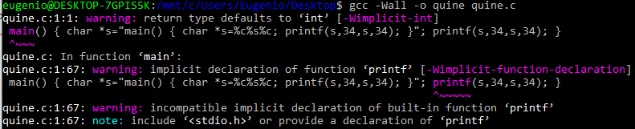

# update: a program that prints it's source code without taking any input is called a 'quine'
After the famous mathematician.
Here is an example in C:

`main() { char *s="main() { char *s=%c%s%c; printf(s,34,s,34); }"; printf(s,34,s,34); }`

Notice how #include<stdio.h> is not present, we get the corresponding compiler warning(implicit function declaration) 

.

A program can run with implicit function declarations because a function is just a pointer(very roughly). When a fucntion is called, the system pushes the context to the stack and passes control to the called function. This one in turn expects all its arguments on the stack, if none or fewer than those expected are passed then the function will take whatever there is on the stack(undefined behaviour). In the same way if we use printf without including its definition, it will default to the implicit declaration 'int printf()'. The code itself is in the text segment of the memory (below the heap, read only). There is also a warning about the return type defaulting to int, this is because the code doesn't specify a return type for main and the function doesn't return anything. GCC also contains built in declarations for some basic functions, including printf, which is the reason for the last warning, it is also the reason why the program works without stdio.

# self-reference
This (useless) program outputs its source code.

Self reference is the basis of the limitations of computational machines (see halting problem), on the other hand some believe that self reference might be the origin of consciousness in humans (we are conscious because we think and we can also think about ourselves thinking). These two are contradictory however(the first is a limitation while the second is significant expansion of functionalities). An interesting question is "what is the relation between the human mind and finite machines?", because the mind is not independent from its material substrate(the proof is that I couldn't be writing this if I drank a bottle on wine first :)). Can the mind solve problems that computers can't(even theoretically)? If so, then it must be more than just a finite machine, which imposes the very hard question "what is that 'more'?". If, on the other hand, the mind is a finite machine, then it means that it is possible to build an artificial one (which is so cool, but still doesn't mean that we could manage it).
A popular idea in the field of artificial intelligence is that what we perceive as intelligence can be described precisely enough to make a machine to simulate it. From the dartmouth workshop proposal "*The study is to proceed on the basis of the conjecture that every aspect of learning or any other feature of intelligence can in principle be so precisely described that a machine can be made to simulate it.*"
